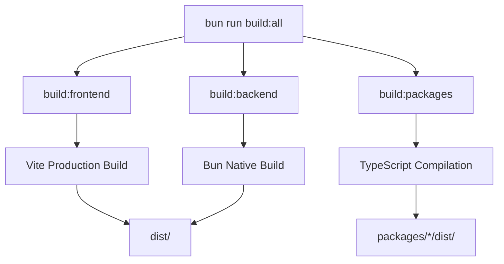

# CC Wrapper Build Process

This document describes the build system architecture, build workflows, and
optimization strategies used in CC Wrapper.

## Table of Contents

- [Overview](#overview)
- [Build Architecture](#build-architecture)
- [Build Scripts](#build-scripts)
- [Build Targets](#build-targets)
- [Build Optimization](#build-optimization)
- [Build Artifacts](#build-artifacts)
- [Troubleshooting](#troubleshooting)

## Overview

CC Wrapper uses a multi-target build system optimized for a monorepo structure:

- **Frontend:** Vite 7.0.0 for fast builds and HMR
- **Backend:** Bun's native build system for server-side code
- **Packages:** TypeScript compiler for shared libraries
- **Performance target:** < 30 seconds for complete build

### Build Tools

| Tool       | Purpose                  | Version |
| ---------- | ------------------------ | ------- |
| Vite       | Frontend build pipeline  | 7.0.0   |
| Bun        | Backend build + runtime  | 1.3.0   |
| TypeScript | Type checking + packages | 5.9.3   |
| esbuild    | Minification (via Vite)  | Latest  |

## Build Architecture

### Monorepo Structure

```
cc-wrapper/
├── apps/          # Frontend applications (Vite build)
├── services/      # Backend services (Bun build)
├── packages/      # Shared packages (TypeScript build)
└── dist/          # Build output
```

### Build Flow



## Build Scripts

### Primary Build Commands

```bash
# Build everything (recommended)
bun run build:all

# Build specific targets
bun run build:frontend  # Frontend only
bun run build:backend   # Backend only
bun run build:packages  # Packages only

# Watch mode for development
bun run build:watch     # Frontend watch mode

# Preview production build
bun run preview         # Serve production build locally
```

### Build Script Details

#### `build:all`

Complete build of all targets in sequence.

```json
{
  "build:all": "bun run build:frontend && bun run build:backend && bun run build:packages"
}
```

**Executes:**

1. Frontend build with Vite
2. Backend build with Bun
3. Package builds with TypeScript

**Output:**

- `dist/` - Frontend and backend artifacts
- `packages/*/dist/` - Package distributions

**Performance:** Target < 30 seconds

#### `build:frontend`

Builds the frontend application using Vite.

```json
{
  "build:frontend": "vite build"
}
```

**Configuration:** `vite.config.ts`

**Features:**

- React 19.2.0 with Fast Refresh
- Production minification with esbuild
- Code splitting with vendor chunks
- Tree shaking for smaller bundles
- Source map generation
- Asset optimization

**Output:** `dist/`

#### `build:backend`

Builds backend services using Bun's native build system.

```json
{
  "build:backend": "bun build src/index.ts --outdir dist --target bun --sourcemap"
}
```

**Features:**

- Bun runtime target optimization
- Source map generation
- Minification
- Fast incremental builds

**Output:** `dist/`

#### `build:packages`

Builds all shared packages in the monorepo.

```json
{
  "build:packages": "bun run --filter './packages/*' build"
}
```

**For each package:**

- TypeScript compilation
- Type declaration generation (.d.ts)
- Source map generation

**Output:** `packages/*/dist/`

## Build Targets

### Frontend Build (Vite)

**Configuration:** `vite.config.ts`

```typescript
export default defineConfig({
  plugins: [react()],
  build: {
    outDir: 'dist',
    sourcemap: true,
    minify: 'esbuild',
    target: 'es2022',
    rollupOptions: {
      output: {
        manualChunks: {
          vendor: ['react', 'react-dom']
        }
      }
    }
  }
});
```

**Build Steps:**

1. **Dependency Resolution** - Resolve all imports
2. **Transformation** - Transform JSX/TSX to JavaScript
3. **Bundling** - Bundle modules using Rollup
4. **Code Splitting** - Split into chunks (main + vendor)
5. **Minification** - Minify with esbuild
6. **Asset Processing** - Optimize images, fonts, etc.
7. **Output** - Write to `dist/`

**Optimizations:**

- Vendor chunk for framework code (React)
- Tree shaking to remove unused code
- CSS minification and extraction
- Asset hashing for cache busting

**Typical Output:**

```
dist/
├── index.html           # Entry HTML
├── assets/
│   ├── index-[hash].js  # Main application bundle
│   ├── vendor-[hash].js # Framework bundle (React)
│   └── index-[hash].css # Styles
└── ...
```

### Backend Build (Bun)

**Command:** `bun build src/index.ts --outdir dist --target bun --sourcemap`

**Build Steps:**

1. **Entry Point** - Start from `src/index.ts`
2. **Dependency Resolution** - Resolve all imports
3. **Transformation** - Transform TypeScript to JavaScript
4. **Bundling** - Bundle for Bun runtime
5. **Source Maps** - Generate source maps
6. **Output** - Write to `dist/`

**Optimizations:**

- Bun runtime target for optimal performance
- Native Bun APIs optimization
- Fast incremental builds

**Typical Output:**

```
dist/
├── index.js        # Bundled backend
└── index.js.map    # Source map
```

### Package Build (TypeScript)

**Configuration:** Each package has its own `tsconfig.build.json`

```json
{
  "extends": "../../tsconfig.json",
  "compilerOptions": {
    "outDir": "./dist",
    "declaration": true,
    "declarationMap": true,
    "sourceMap": true
  },
  "include": ["src/**/*"],
  "exclude": ["**/*.test.ts", "**/*.spec.ts"]
}
```

**Build Steps:**

1. **Type Checking** - Validate all types
2. **Compilation** - Compile TypeScript to JavaScript
3. **Declaration Generation** - Generate .d.ts files
4. **Source Maps** - Generate source maps
5. **Output** - Write to `packages/*/dist/`

**Typical Output:**

```
packages/shared-utils/dist/
├── index.js          # Compiled JavaScript
├── index.d.ts        # Type declarations
├── index.js.map      # Source map
└── index.d.ts.map    # Declaration map
```

## Build Optimization

### Production Optimizations

#### Minification

- **Frontend:** esbuild minifier (via Vite)
- **CSS:** CSS minification enabled
- **Backend:** Bun native minification

#### Code Splitting

Frontend code is split into chunks:

```typescript
// vite.config.ts
rollupOptions: {
  output: {
    manualChunks: {
      vendor: ['react', 'react-dom'];
    }
  }
}
```

**Benefits:**

- Smaller initial bundle
- Better caching (vendor rarely changes)
- Faster page loads

#### Tree Shaking

Unused code is automatically removed:

```typescript
// Only imported functions are included in bundle
import { formatDate } from '@/utils'; // ✅ Included
import { formatCurrency } from '@/utils'; // ❌ Not used, excluded
```

#### Asset Optimization

- **Images:** Optimized during build
- **Fonts:** Subset and optimized
- **SVGs:** Minified

### Build Performance

**Current Performance:**

- Frontend build: ~1-2 seconds
- Backend build: ~0.3 seconds
- Package builds: ~1 second each
- **Total:** ~5-10 seconds (target: < 30 seconds)

**Performance Tips:**

```bash
# Clean before build for accurate timing
bun run clean && bun run build:all

# Use watch mode during development
bun run build:watch

# Parallel builds (when possible)
# Frontend and backend can build in parallel
```

### Caching

**Bun Cache:**

- Dependency cache: `~/.bun/install/cache`
- Build cache: `.bun-cache/`

**Vite Cache:**

- Node modules cache: `node_modules/.vite`

**Clean cache:**

```bash
bun run clean       # Removes build artifacts and .bun-cache
bun run clean:all   # Also removes node_modules
```

## Build Artifacts

### Frontend Artifacts

Located in `dist/`:

```
dist/
├── index.html              # Entry HTML with injected assets
├── assets/
│   ├── index-[hash].js     # Main bundle (~50-100KB gzipped)
│   ├── vendor-[hash].js    # Vendor bundle (~150KB gzipped)
│   ├── index-[hash].css    # Styles (~10KB gzipped)
│   └── [asset]-[hash].*    # Other assets (images, fonts)
└── favicon.ico
```

### Backend Artifacts

Located in `dist/`:

```
dist/
├── index.js           # Backend bundle (~10-50KB)
└── index.js.map       # Source map for debugging
```

### Package Artifacts

Located in `packages/*/dist/`:

```
packages/shared-utils/dist/
├── index.js           # Compiled code
├── index.d.ts         # Type declarations
├── index.js.map       # Source map
└── index.d.ts.map     # Declaration map
```

### Artifact Sizes

Typical sizes (gzipped):

- Frontend main bundle: 50-100KB
- Frontend vendor bundle: 150KB (React + ReactDOM)
- Backend bundle: 10-50KB
- Package bundles: 1-10KB each

## Build Verification

### After Build

```bash
# Build all targets
bun run build:all

# Verify output exists
ls -lh dist/
ls -lh packages/*/dist/

# Check bundle sizes
du -h dist/

# Test production build locally
bun run preview
```

### CI/CD Build

In CI/CD, builds include additional steps:

```bash
# 1. Install dependencies
bun install --frozen-lockfile

# 2. Type check
bun run type-check

# 3. Lint
bun run lint

# 4. Test
bun test

# 5. Build
bun run build:all

# 6. Upload artifacts
# (handled by GitHub Actions)
```

## Troubleshooting

### Build Failures

#### "Cannot find module"

**Cause:** Missing dependency or incorrect import

**Solution:**

```bash
# Reinstall dependencies
bun install

# Check import paths
bun run type-check
```

#### "Out of memory"

**Cause:** Large build consuming too much memory

**Solution:**

```bash
# Increase Node memory limit
NODE_OPTIONS="--max-old-space-size=4096" bun run build:all

# Or build targets separately
bun run build:frontend
bun run build:backend
bun run build:packages
```

#### "Build is slow"

**Cause:** Cache issues or large dependencies

**Solution:**

```bash
# Clean and rebuild
bun run clean
bun run build:all

# Check for large dependencies
du -sh node_modules/*
```

### Development Build Issues

#### "Hot reload not working"

**Cause:** Vite dev server issue

**Solution:**

```bash
# Restart dev server
# Ctrl+C to stop
bun run dev
```

#### "Changes not reflected"

**Cause:** Browser cache or build cache

**Solution:**

```bash
# Hard refresh browser (Cmd+Shift+R or Ctrl+Shift+R)
# Or clear Vite cache
rm -rf node_modules/.vite
```

### TypeScript Build Issues

#### "Type error but code works"

**Cause:** TypeScript strict mode catching potential issues

**Solution:**

```bash
# Review type error
bun run type-check

# Fix type error (don't use @ts-ignore)
# Add proper types or fix code
```

#### "Declaration generation failed"

**Cause:** Complex types or circular dependencies

**Solution:**

```bash
# Check package tsconfig
cat packages/*/tsconfig.json

# Ensure proper type exports
```

## Build Best Practices

### 1. Always Clean Before Production Builds

```bash
bun run clean && bun run build:all
```

### 2. Verify Builds Locally

```bash
# Build and preview
bun run build:all
bun run preview
```

### 3. Monitor Build Sizes

```bash
# Check bundle sizes
du -h dist/assets/*
```

Keep bundles small:

- Main bundle: < 100KB gzipped
- Vendor bundle: < 200KB gzipped

### 4. Use Source Maps

Always enable source maps for debugging:

- Development: Inline source maps
- Production: Separate .map files

### 5. Test Production Builds

```bash
# Build
bun run build:all

# Preview
bun run preview

# Test in browser
open http://localhost:4173
```

## Additional Resources

- [Vite Documentation](https://vitejs.dev)
- [Bun Build Documentation](https://bun.sh/docs/bundler)
- [TypeScript Compiler Options](https://www.typescriptlang.org/tsconfig)
- [Development Workflow](development-workflow.md)
- [Deployment Guide](deployment.md)

---

**Questions?** Open a
[GitHub Issue](https://github.com/ccwrapper/cc-wrapper/issues) for build-related
questions.
