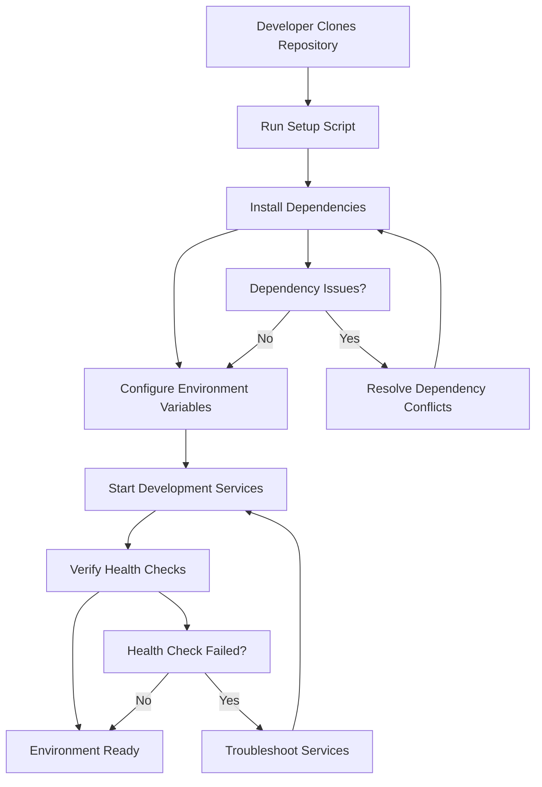
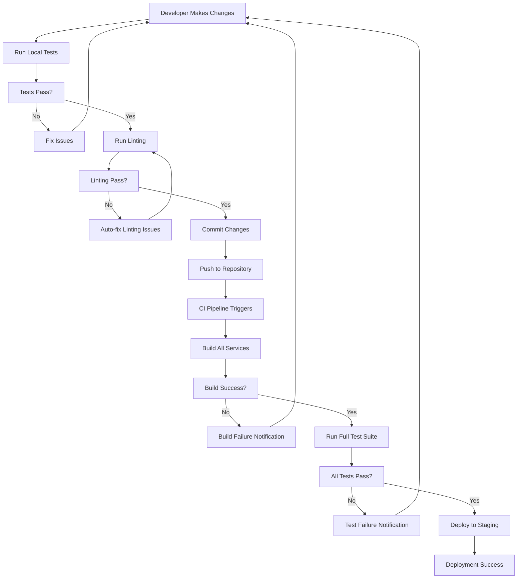
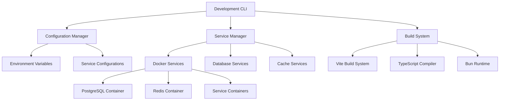

# Technical Specification: Project Bootstrap & Development Infrastructure

Date: 2025-10-19 Author: Eduardo Menoncello Epic ID: 0 Status: Draft

---

## Overview

Epic 0 establishes the foundational development infrastructure and tooling
required to begin CC Wrapper implementation. This epic addresses the critical
gap between comprehensive product requirements (PRD) and technical architecture
(solution-architecture) by creating the development environment, build systems,
and project structure necessary for productive development work.

Based on the sprint change proposal analysis, the project requires bootstrap
infrastructure to enable immediate development productivity. This epic provides
the technical foundation for all subsequent epics, ensuring the development team
has properly configured environments, automated processes, and established
project structure before implementing core features.

The epic directly supports the project's strategic goals of creating an
enterprise-grade AI orchestration platform by establishing development best
practices, quality assurance processes, and deployment pipelines that will scale
with the product's growth from MVP to enterprise SaaS platform.

## Objectives and Scope

### Primary Objectives

1. **Development Environment Configuration**: Establish fully configured
   development environments with all necessary tools, dependencies, and
   configurations
2. **Project Structure Establishment**: Create organized project structure
   following modern development best practices with clear separation of concerns
3. **Build and Automation Systems**: Implement automated build, test, lint, and
   deployment processes for consistent code quality
4. **Quality Assurance Infrastructure**: Set up testing frameworks, code quality
   tools, and CI/CD pipelines
5. **Documentation and Guidelines**: Create comprehensive development
   documentation and contribution guidelines

### In-Scope Items

- Development environment setup scripts and configurations
- Project directory structure and organization
- Package management configuration (package.json, dependency management)
- Build system configuration for production deployments
- Automated testing framework setup with sample tests
- Code quality tools (ESLint, Prettier, TypeScript configuration)
- CI/CD pipeline configuration (GitHub Actions or similar)
- Environment variable management and configuration systems
- Local development services (database, caching)
- Documentation structure and contribution guidelines
- Development scripts for common tasks (build, test, lint, deploy)

### Out-of-Scope Items

- Application business logic implementation
- User interface components and features
- Database schema design for application data
- API endpoint implementation
- Authentication and authorization systems
- AI tool integration implementation
- Production deployment infrastructure
- Monitoring and observability setup for production
- Performance optimization and tuning

### Dependencies and Prerequisites

- **No technical prerequisites** (bootstrap epic)
- Sprint Change Proposal approval
- Development team availability for implementation

## System Architecture Alignment

Epic 0 aligns with the established microservices architecture by providing the
foundational development infrastructure that supports the planned technology
stack:

### Technology Stack Foundation

- **Bun Runtime Environment**: Establish Bun 1.3.0 as the exclusive runtime for
  all development and build processes
- **TypeScript Configuration**: Set up TypeScript 5.9.3 with strict typing and
  ECMAScript defer support across all services
- **Monorepo Structure**: Initialize the monorepo structure that will house the
  microservices (Authentication, Workspace, AI Orchestration, Real-time Sync,
  Analytics, Notification services)
- **Package Management**: Configure Bun package manager for ultra-fast installs
  and monorepo dependency management

### Development Environment Support

- **Container Development**: Set up Docker 28.5.1 development environment
  matching production deployment patterns
- **Database Development**: Configure PostgreSQL 18.0 and Redis 8.2.2 for local
  development with migration tooling
- **Real-time Development**: Establish WebSocket development environment with
  Redis pub/sub for testing real-time synchronization
- **Testing Infrastructure**: Implement Bun Test + Playwright testing framework
  across all microservices

### Build and Deployment Alignment

- **Astro + React Build System**: Configure Vite 7.0.0 build pipeline for the
  hybrid frontend architecture
- **Service Building**: Set up individual build processes for each microservice
  with proper dependency management
- **Docker Compose Development**: Configure Docker Compose 2.27.0 for local
  multi-service development
- **Quality Gates**: Implement linting, formatting, and type checking aligned
  with the architecture's quality standards

This bootstrap epic establishes the technical foundation that enables seamless
development of the planned microservices architecture while maintaining
consistency with the chosen technology stack and development practices.

## Detailed Design

### Services and Modules

Epic 0 focuses on development infrastructure rather than application services.
The following modules establish the foundation for all subsequent development:

#### Development Infrastructure Modules

| Module                | Responsibility                                                      | Owner             | Inputs                      | Outputs                                          |
| --------------------- | ------------------------------------------------------------------- | ----------------- | --------------------------- | ------------------------------------------------ |
| **Environment Setup** | Configure local development environment with all runtimes and tools | DevOps            | System requirements         | Development scripts, environment configurations  |
| **Project Structure** | Establish monorepo structure with service boundaries                | Architecture Lead | Technology stack decisions  | Directory structure, package.json configurations |
| **Build System**      | Configure build processes for all services and frontend             | Build Engineer    | Source code, dependencies   | Build artifacts, deployment packages             |
| **Quality Tools**     | Implement linting, formatting, and type checking                    | Quality Lead      | Source code standards       | Quality reports, formatted code                  |
| **Testing Framework** | Set up testing infrastructure and sample tests                      | QA Lead           | Test requirements           | Test suites, coverage reports                    |
| **CI/CD Pipeline**    | Configure automated build and deployment processes                  | DevOps            | Repository, build artifacts | Automated workflows, deployment pipelines        |

#### Development Environment Components

1. **Runtime Configuration**
   - Bun 1.3.0 runtime setup and configuration
   - Node.js compatibility layer configuration (if needed)
   - TypeScript 5.9.3 compiler configuration
   - Environment variable management system

2. **Development Tools**
   - Code editor/IDE configuration (VS Code recommended)
   - Extension setup for TypeScript, Bun, Docker
   - Debugger configuration for microservices
   - Terminal integration tools

3. **Database Services**
   - PostgreSQL 18.0 local development instance
   - Redis 8.2.2 local development instance
   - Database migration tooling setup
   - Connection pooling configuration

4. **Container Development**
   - Docker 28.5.1 development environment
   - Docker Compose 2.27.0 configuration
   - Development container definitions
   - Volume mounting and networking setup

### Data Models and Contracts

Epic 0 focuses on development infrastructure configuration rather than
application data models. The primary data structures and configuration schemas
are:

#### Configuration Data Models

```typescript
// Development Environment Configuration
interface DevEnvironmentConfig {
  runtime: {
    bun: string;
    typescript: string;
    node?: string; // compatibility layer
  };
  databases: {
    postgresql: {
      version: string;
      port: number;
      database: string;
      username: string;
    };
    redis: {
      version: string;
      port: number;
      database: number;
    };
  };
  services: {
    ports: Record<string, number>;
    environments: Record<string, string>;
  };
}

// Project Structure Configuration
interface ProjectStructureConfig {
  name: string;
  version: string;
  workspaces: {
    'packages/*': string[];
    'services/*': string[];
    'apps/*': string[];
  };
  scripts: Record<string, string>;
  dependencies: {
    [key: string]: string;
  };
  devDependencies: {
    [key: string]: string;
  };
}

// Build Configuration Schema
interface BuildConfig {
  vite: {
    root: string;
    build: {
      outDir: string;
      target: string[];
      minify: boolean;
    };
    server: {
      port: number;
      host: string;
    };
  };
  docker: {
    baseImage: string;
    buildArgs: Record<string, string>;
    ports: number[];
    volumes: string[];
  };
}

// Quality Tools Configuration
interface QualityConfig {
  eslint: {
    extends: string[];
    rules: Record<string, any>;
    ignorePatterns: string[];
  };
  prettier: {
    semi: boolean;
    trailingComma: string;
    singleQuote: boolean;
    tabWidth: number;
  };
  typescript: {
    compilerOptions: {
      strict: boolean;
      target: string;
      module: string;
      moduleResolution: string;
      esModuleInterop: boolean;
      skipLibCheck: boolean;
    };
  };
}
```

#### Package.json Contract Templates

```json
{
  "name": "@cc-wrapper/root",
  "private": true,
  "workspaces": ["packages/*", "services/*", "apps/*"],
  "scripts": {
    "dev": "bun run dev:docker",
    "build": "bun run build:all",
    "test": "bun test --coverage",
    "lint": "bun run lint:all",
    "format": "bun run format:all",
    "type-check": "bun run type-check:all"
  },
  "devDependencies": {
    "@types/bun": "latest",
    "typescript": "5.9.3",
    "eslint": "latest",
    "prettier": "latest",
    "vite": "7.0.0"
  }
}
```

#### Environment Variable Schema

```typescript
interface EnvironmentVariables {
  // Development Environment
  NODE_ENV: 'development' | 'production' | 'test';
  PORT: number;

  // Database Configuration
  DATABASE_URL: string;
  REDIS_URL: string;

  // Service Configuration
  AUTH_SERVICE_URL: string;
  WORKSPACE_SERVICE_URL: string;
  AI_SERVICE_URL: string;

  // Development Tools
  LOG_LEVEL: 'debug' | 'info' | 'warn' | 'error';
  ENABLE_HOT_RELOAD: boolean;
  ENABLE_SOURCE_MAPS: boolean;
}
```

### APIs and Interfaces

Epic 0 focuses on development infrastructure interfaces and CLI tools rather
than application APIs. The primary interfaces are:

#### Development CLI Interface

```typescript
// CLI Command Interface
interface DevCommand {
  name: string;
  description: string;
  options: CommandOption[];
  action: (args: CommandArgs) => Promise<void>;
}

interface CommandOption {
  name: string;
  alias?: string;
  description: string;
  type: 'string' | 'number' | 'boolean';
  required?: boolean;
  default?: any;
}

// Development Commands
const devCommands: DevCommand[] = [
  {
    name: 'dev',
    description: 'Start development environment',
    options: [
      {
        name: 'service',
        alias: 's',
        description: 'Specific service to start',
        type: 'string'
      },
      {
        name: 'debug',
        alias: 'd',
        description: 'Enable debug mode',
        type: 'boolean',
        default: false
      }
    ],
    action: startDevEnvironment
  },
  {
    name: 'build',
    description: 'Build all services and applications',
    options: [
      {
        name: 'watch',
        alias: 'w',
        description: 'Watch for changes',
        type: 'boolean',
        default: false
      },
      {
        name: 'service',
        alias: 's',
        description: 'Specific service to build',
        type: 'string'
      }
    ],
    action: buildServices
  },
  {
    name: 'test',
    description: 'Run test suites',
    options: [
      {
        name: 'coverage',
        alias: 'c',
        description: 'Generate coverage report',
        type: 'boolean',
        default: false
      },
      {
        name: 'watch',
        alias: 'w',
        description: 'Watch mode',
        type: 'boolean',
        default: false
      }
    ],
    action: runTests
  },
  {
    name: 'lint',
    description: 'Run linting and formatting',
    options: [
      {
        name: 'fix',
        alias: 'f',
        description: 'Auto-fix issues',
        type: 'boolean',
        default: false
      },
      {
        name: 'check',
        description: 'Check only, no fixes',
        type: 'boolean',
        default: true
      }
    ],
    action: runLinting
  }
];
```

#### Development Service Health Check Interface

```typescript
// Service Health Check Endpoint
interface HealthCheckResponse {
  status: 'healthy' | 'degraded' | 'unhealthy';
  services: ServiceHealth[];
  timestamp: string;
  uptime: number;
}

interface ServiceHealth {
  name: string;
  status: 'up' | 'down';
  responseTime: number;
  lastCheck: string;
  dependencies: DependencyHealth[];
}

interface DependencyHealth {
  name: string;
  type: 'database' | 'cache' | 'external-api';
  status: 'connected' | 'disconnected';
  responseTime?: number;
}

// Health Check Routes
GET / health;
GET / health / service / { serviceName };
GET / health / dependencies;
```

#### Development Configuration Interface

```typescript
// Configuration Management Interface
interface ConfigManager {
  load(): Promise<DevEnvironmentConfig>;
  validate(config: DevEnvironmentConfig): ValidationResult;
  get(key: string): any;
  set(key: string, value: any): Promise<void>;
  reload(): Promise<void>;
}

interface ValidationResult {
  valid: boolean;
  errors: ValidationError[];
  warnings: ValidationWarning[];
}

interface ValidationError {
  path: string;
  message: string;
  severity: 'error' | 'warning';
}
```

#### Docker Development Interface

```typescript
// Development Container Interface
interface DevContainer {
  name: string;
  image: string;
  ports: PortMapping[];
  volumes: VolumeMapping[];
  environment: Record<string, string>;
  dependencies: string[];
  healthCheck?: HealthCheckConfig;
}

interface PortMapping {
  host: number;
  container: number;
  protocol: 'tcp' | 'udp';
}

interface VolumeMapping {
  host: string;
  container: string;
  mode: 'rw' | 'ro';
}

// Docker Compose Development Configuration
interface DockerComposeDevConfig {
  version: string;
  services: Record<string, DevContainer>;
  networks: Record<string, NetworkConfig>;
  volumes: Record<string, VolumeConfig>;
}
```

### Workflows and Sequencing

Epic 0 establishes development workflows that enable efficient team
collaboration and consistent delivery processes.

#### Development Environment Setup Workflow



#### Build and Test Workflow



#### Development Service Dependencies



#### Local Development Sequence

1. **Initial Setup (Story 0.1)**
   - Clone repository and run setup script
   - Install Bun 1.3.0 and verify installation
   - Configure development environment variables
   - Start local database services (PostgreSQL, Redis)
   - Verify all services are healthy and accessible

2. **Development Workflow (Story 0.2)**
   - Create feature branch from main
   - Make code changes following established patterns
   - Run local tests with coverage
   - Execute linting and formatting checks
   - Build services and verify compilation
   - Commit changes with proper formatting
   - Push and monitor CI/CD pipeline

3. **Quality Gates**
   - All tests must pass with minimum 80% coverage
   - Zero linting errors or warnings
   - Successful TypeScript compilation with strict mode
   - All services build without errors
   - Documentation updated for API changes

#### Service Startup Sequence

1. **Infrastructure Services**
   - Start PostgreSQL (port 5432)
   - Start Redis (port 6379)
   - Verify database connectivity

2. **Development Services**
   - Start authentication service (port 3001)
   - Start workspace service (port 3002)
   - Start AI orchestration service (port 3003)
   - Start real-time sync service (port 3004)

3. **Frontend Development**
   - Start Vite development server (port 5173)
   - Enable hot reload and source maps
   - Open browser to development environment

4. **Health Verification**
   - Run health check endpoint tests
   - Verify service-to-service communication
   - Test database connections and migrations
   - Confirm WebSocket connectivity

## Non-Functional Requirements

### Performance

**Development Environment Performance:**

- **Startup Time**: Full development environment ready within 60 seconds from
  repository clone
- **Build Time**: Complete project build in under 30 seconds on standard
  development machines
- **Hot Reload**: File changes reflected in under 200ms for frontend and under
  1s for backend services
- **Test Execution**: Full test suite completion in under 2 minutes with
  parallel execution
- **Dependency Installation**: Monorepo dependencies installed in under 10
  seconds with Bun

**CLI Tool Performance:**

- **Command Response Time**: All CLI commands respond within 500ms
- **Service Health Checks**: Complete health verification within 2 seconds
- **Configuration Loading**: Environment configuration loaded and validated
  within 1 second
- **Code Generation**: Scaffold and template generation completed within 3
  seconds

**Resource Requirements:**

- **Memory Usage**: Development environment requires minimum 8GB RAM,
  recommended 16GB
- **Disk Space**: 5GB available space for complete development environment
  including dependencies
- **CPU**: Modern multi-core processor recommended for parallel build processes

These targets align with developer productivity expectations and ensure minimal
waiting time during development activities.

### Security

**Development Environment Security:**

- **API Key Management**: Development API keys stored in encrypted local
  configuration, never committed to version control
- **Environment Variable Protection**: Sensitive configuration values encrypted
  at rest with proper access controls
- **Database Security**: Local development databases configured with strong
  authentication, no external network access
- **Container Security**: Development containers run with non-root users and
  minimal privilege escalation

**Code Security Practices:**

- **Dependency Scanning**: Automated vulnerability scanning of all dependencies
  on install and in CI/CD pipeline
- **Secret Detection**: Pre-commit hooks prevent accidental commit of API keys,
  passwords, or sensitive data
- **Code Quality Gates**: ESLint and TypeScript security rules enforced with
  zero tolerance for violations
- **Supply Chain Security**: Package integrity verification using checksums and
  trusted registries

**Development Tool Security:**

- **IDE Security**: Code editor extensions vetted for security vulnerabilities,
  automatic security updates enabled
- **Network Security**: Development services bound to localhost, no external
  network exposure by default
- **Authentication**: Development authentication uses local credentials, no
  integration with production identity providers
- **Audit Logging**: Development environment actions logged for security
  monitoring and troubleshooting

**Compliance Requirements:**

- **Data Protection**: No production data used in development environment,
  synthetic data only
- **Access Control**: Development environment access restricted to authorized
  team members
- **Change Management**: All configuration changes tracked in version control
  with proper review process

These security measures ensure development environment safety while maintaining
developer productivity and ease of use.

### Reliability/Availability

**Development Environment Reliability:**

- **Uptime Target**: Development environment available 99% of scheduled
  development time
- **Service Recovery**: Automatic restart of failed development services within
  30 seconds
- **Data Persistence**: Development data and configurations preserved across
  service restarts and system reboots
- **State Consistency**: Development environment state synchronized across all
  tools and services

**Build System Reliability:**

- **Build Success Rate**: 99.5% of builds succeed for valid code changes
- **Deterministic Builds**: identical source code produces identical build
  artifacts
- **Incremental Builds**: Only changed components rebuilt, maintaining build
  reliability while improving speed
- **Build Cache**: Reliable caching system to avoid unnecessary rebuilds

**Error Handling and Recovery:**

- **Graceful Degradation**: Development tools continue functioning with reduced
  capability when dependencies fail
- **Error Isolation**: Failures in one development service do not cascade to
  other services
- **Automatic Recovery**: Self-healing mechanisms for common development
  environment issues
- **Clear Error Messages**: Detailed, actionable error messages with suggested
  resolution steps

**Development Workflow Reliability:**

- **Consistent Environment**: All developers use identical development
  environment configurations
- **Reproducible Builds**: Build process reproducible across different machines
  and platforms
- **Version Compatibility**: Automated verification of tool and dependency
  version compatibility
- **Rollback Capability**: Quick rollback to previous working state when issues
  occur

**Backup and Recovery:**

- **Configuration Backup**: Automatic backup of development configurations and
  settings
- **Data Backup**: Regular backups of development databases and important
  configuration files
- **Quick Recovery**: Complete development environment restoration within 15
  minutes from backup

These reliability measures ensure developers can work productively with minimal
interruptions and quick recovery from issues.

### Observability

**Development Environment Monitoring:**

- **Health Check Endpoints**: Comprehensive health monitoring for all
  development services with status, response times, and dependency health
- **Resource Usage Monitoring**: Real-time monitoring of CPU, memory, disk usage
  for development services and databases
- **Service Dependency Mapping**: Clear visualization of service dependencies
  and their current status
- **Performance Metrics**: Build times, test execution times, and development
  environment startup performance tracking

**Logging Infrastructure:**

- **Structured Logging**: Consistent, structured logging format across all
  development tools and services
- **Log Levels**: Configurable log levels (debug, info, warn, error) with
  appropriate filtering
- **Log Aggregation**: Centralized logging for all development services with
  search and filtering capabilities
- **Development Activity Logging**: Automated logging of development actions,
  builds, tests, and deployments

**Development Metrics:**

- **Build Success Metrics**: Track build success rates, failure reasons, and
  build time trends
- **Test Coverage Tracking**: Continuous monitoring of test coverage with trend
  analysis and coverage gaps identification
- **Code Quality Metrics**: ESLint violations, TypeScript errors, and code
  complexity metrics tracking
- **Developer Productivity Metrics**: Time spent on builds, tests, and other
  development activities

**Error Tracking and Alerting:**

- **Error Aggregation**: Centralized error tracking with automatic grouping and
  root cause analysis
- **Performance Alerts**: Automated alerts for slow builds, failing tests, or
  degraded development environment performance
- **Dependency Health Monitoring**: Monitoring of external dependencies and
  services with failure notifications
- **Development Environment Alerts**: Proactive alerts for disk space, memory
  usage, or other resource constraints

**Debugging Support:**

- **Request Tracing**: End-to-end request tracing through development services
  for debugging
- **Service Mesh Visibility**: Service-to-service communication monitoring and
  performance analysis
- **Database Query Monitoring**: Database query performance monitoring with slow
  query identification
- **Hot Reload Debugging**: Real-time debugging information for hot reload
  processes

**Development Analytics:**

- **Usage Analytics**: Development tool usage patterns and feature adoption
  tracking
- **Performance Trends**: Historical performance data for development
  environment optimization
- **Team Productivity Insights**: Anonymous team productivity metrics for
  process improvement
- **Tool Effectiveness Metrics**: Measurement of development tool effectiveness
  and developer satisfaction

This observability infrastructure ensures development environment issues are
quickly identified and resolved while providing insights for continuous
improvement of the development experience.

## Dependencies and Integrations

### Development Environment Dependencies

**Core Runtime Dependencies:**

- **Bun 1.3.0**: Primary JavaScript runtime, package manager, and build tool
- **TypeScript 5.9.3**: Static typing and compilation for all TypeScript code
- **Node.js 20+**: Compatibility layer for packages requiring Node.js APIs

**Development Tools Dependencies:**

- **ESLint Latest**: JavaScript/TypeScript linting and code quality enforcement
- **Prettier Latest**: Code formatting and style consistency
- **Vite 7.0.0**: Build tool and development server for frontend
- **Playwright 1.56.0**: End-to-end testing framework
- **Bun Test**: Unit and integration testing framework

**Container and Infrastructure Dependencies:**

- **Docker 28.5.1**: Container platform for development and production
- **Docker Compose 2.27.0**: Multi-container orchestration for local development
- **PostgreSQL 18.0**: Primary database for development and testing
- **Redis 8.2.2**: Caching and session storage

### Development Service Integrations

**Version Control Integration:**

- **Git**: Source code management with standard branching workflow
- **GitHub**: Code hosting, collaboration, and CI/CD pipeline
- **Git Hooks**: Pre-commit hooks for code quality and security checks

**IDE and Editor Integration:**

- **VS Code**: Primary development environment with recommended extensions
- **TypeScript Language Server**: Real-time type checking and IntelliSense
- **ESLint Extension**: Real-time linting feedback in IDE
- **Docker Extension**: Container management within IDE

**Development Database Integration:**

- **Local PostgreSQL**: Development database with migration tooling
- **Local Redis**: Development cache and session storage
- **Database Migration Tools**: Schema management and versioning
- **Connection Pooling**: Efficient database connection management

### External Service Integrations

**Package Registry Integration:**

- **npm Registry**: Primary package source for JavaScript/TypeScript packages
- **GitHub Packages**: Private package hosting for internal packages
- **Docker Hub**: Container image registry for base images

**Development Tool Integrations:**

- **GitHub Actions**: CI/CD pipeline for automated builds and tests
- **Code Coverage Services**: Test coverage tracking and reporting
- **Dependency Scanning**: Automated vulnerability scanning for dependencies

### Integration Configuration

**Environment Variable Management:**

```typescript
// Development environment configuration
interface DevelopmentIntegrations {
  versionControl: {
    provider: 'github';
    repository: string;
    branchProtection: string[];
  };
  packageRegistry: {
    npm: boolean;
    githubPackages: boolean;
    privateRegistries: string[];
  };
  cicd: {
    provider: 'github-actions';
    workflows: string[];
    automatedTests: boolean;
    deploymentEnabled: boolean;
  };
  databases: {
    postgresql: {
      host: 'localhost';
      port: 5432;
      database: string;
    };
    redis: {
      host: 'localhost';
      port: 6379;
      database: number;
    };
  };
}
```

**Service Integration Points:**

- **Authentication Service**: Integration with local development user management
- **Workspace Service**: Integration with file system and project structure
- **AI Service**: Integration with AI provider APIs for development testing
- **Real-time Sync**: Integration with WebSocket infrastructure for development

**Version Constraints:**

- All dependencies pinned to specific versions for reproducible builds
- Automated dependency updates with security patch prioritization
- Compatibility matrix maintained for all development dependencies
- Regular dependency security scanning and updates

## Acceptance Criteria (Authoritative)

### Story 0.1: Development Environment Setup

**AC 0.1.1**: Developer can run setup script and have fully configured
development environment within 60 seconds

- Given: Developer clones repository
- When: They run the setup script
- Then: All dependencies are installed, environment variables configured, and
  services started

**AC 0.1.2**: All required development tools are installed and configured with
correct versions

- Given: Setup script has completed
- When: Developer checks tool versions
- Then: Bun 1.3.0, TypeScript 5.9.3, Docker 28.5.1, PostgreSQL 18.0, Redis 8.2.2
  are installed and running

**AC 0.1.3**: Development services start successfully and pass health checks

- Given: Development environment is configured
- When: Developer starts development services
- Then: All services respond to health checks within 5 seconds

**AC 0.1.4**: Code editor configuration is applied automatically

- Given: Developer opens project in VS Code
- When: Extensions and settings are applied
- Then: TypeScript, ESLint, Prettier, and Docker extensions are configured
  correctly

**AC 0.1.5**: Environment variables are properly configured and validated

- Given: Development environment is setup
- When: Configuration validation script runs
- Then: All required environment variables are present and valid

**AC 0.1.6**: Documentation provides clear troubleshooting guidance

- Given: Developer encounters setup issues
- When: They consult documentation
- Then: Clear steps are provided to resolve common setup problems

### Story 0.2: Initial Project Structure & Build System

**AC 0.2.1**: Monorepo structure is established with proper workspace
configuration

- Given: Project is initialized
- When: Developer views project structure
- Then: Clear separation exists between packages, services, and applications
  with workspace configuration

**AC 0.2.2**: Build system successfully compiles all services and applications

- Given: Developer makes code changes
- When: They run build command
- Then: All services compile without errors and produce valid artifacts

**AC 0.2.3**: Automated testing framework is configured with sample tests

- Given: Project structure is established
- When: Developer runs test command
- Then: Tests execute successfully with coverage reporting

**AC 0.2.4**: Code quality tools enforce consistent formatting and linting

- Given: Developer writes code
- When: They commit changes
- Then: Code passes all linting and formatting checks automatically

**AC 0.2.5**: CI/CD pipeline automatically builds and tests on code changes

- Given: Developer pushes changes to repository
- When: CI pipeline runs
- Then: Build, test, and quality checks execute automatically with
  success/failure notifications

**AC 0.2.6**: Development scripts provide convenient commands for common tasks

- Given: Developer needs to perform common development tasks
- When: They run npm scripts
- Then: Commands exist for dev, build, test, lint, format, and deployment

**AC 0.2.7**: Documentation structure is established with contribution
guidelines

- Given: New developer joins project
- When: They read documentation
- Then: Clear guidance exists for setup, development practices, and contribution
  process

## Traceability Mapping

### Acceptance Criteria to Specification Traceability

| AC ID    | Acceptance Criteria                                  | Spec Section                   | Component/Service           | Test Idea                       |
| -------- | ---------------------------------------------------- | ------------------------------ | --------------------------- | ------------------------------- |
| AC 0.1.1 | Setup script configures environment in 60s           | Overview, Services and Modules | Environment Setup Module    | Automated setup timing test     |
| AC 0.1.2 | Development tools installed with correct versions    | Dependencies and Integrations  | Runtime Configuration       | Version verification script     |
| AC 0.1.3 | Services start and pass health checks                | APIs and Interfaces            | Health Check Interface      | Service health test suite       |
| AC 0.1.4 | Code editor configuration applied automatically      | Services and Modules           | Development Tools Module    | Extension configuration test    |
| AC 0.1.5 | Environment variables configured and validated       | Data Models and Contracts      | Environment Variable Schema | Configuration validation test   |
| AC 0.1.6 | Documentation provides troubleshooting guidance      | Overview                       | Documentation Structure     | Documentation review checklist  |
| AC 0.2.1 | Monorepo structure with workspace configuration      | Services and Modules           | Project Structure Module    | Workspace validation test       |
| AC 0.2.2 | Build system compiles all services                   | Services and Modules           | Build System                | Build verification test         |
| AC 0.2.3 | Testing framework configured with sample tests       | Services and Modules           | Testing Framework           | Test execution verification     |
| AC 0.2.4 | Code quality tools enforce formatting                | Services and Modules           | Quality Tools               | Linting/formatting test         |
| AC 0.2.5 | CI/CD pipeline builds and tests automatically        | Services and Modules           | CI/CD Pipeline              | Pipeline execution test         |
| AC 0.2.6 | Development scripts for common tasks                 | APIs and Interfaces            | CLI Interface               | Script functionality test       |
| AC 0.2.7 | Documentation structure with contribution guidelines | Overview                       | Documentation Structure     | Documentation completeness test |

### Epic to Story Traceability

| Epic                      | Story                                       | Acceptance Criteria | Implementation Priority |
| ------------------------- | ------------------------------------------- | ------------------- | ----------------------- |
| Epic 0: Project Bootstrap | Story 0.1: Development Environment Setup    | AC 0.1.1 - AC 0.1.6 | P0 (Critical)           |
| Epic 0: Project Bootstrap | Story 0.2: Project Structure & Build System | AC 0.2.1 - AC 0.2.7 | P0 (Critical)           |

### Requirement Traceability to Architecture Components

| Requirement                   | Architecture Component         | Implementation Status |
| ----------------------------- | ------------------------------ | --------------------- |
| Development Environment Setup | Bun Runtime Environment        | Story 0.1             |
| TypeScript Configuration      | TypeScript Compiler            | Story 0.1             |
| Container Development         | Docker Development Environment | Story 0.1             |
| Database Services             | PostgreSQL/Redis Development   | Story 0.1             |
| Project Structure             | Monorepo Structure             | Story 0.2             |
| Build System                  | Vite Build System              | Story 0.2             |
| Quality Tools                 | ESLint/Prettier Configuration  | Story 0.2             |
| Testing Framework             | Bun Test + Playwright          | Story 0.2             |
| CI/CD Pipeline                | GitHub Actions Configuration   | Story 0.2             |

### Test Coverage Mapping

| Test Type         | Coverage Area                                        | Acceptance Criteria Covered |
| ----------------- | ---------------------------------------------------- | --------------------------- |
| Unit Tests        | Configuration validation, CLI commands               | AC 0.1.5, AC 0.2.6          |
| Integration Tests | Service health checks, build system                  | AC 0.1.3, AC 0.2.2          |
| End-to-End Tests  | Setup script execution, development workflow         | AC 0.1.1, AC 0.2.1          |
| Performance Tests | Setup timing, build performance                      | AC 0.1.1, AC 0.2.2          |
| Security Tests    | Environment variable protection, dependency scanning | AC 0.1.5                    |

### Risk Mitigation Traceability

| Risk                 | Mitigation Strategy            | Acceptance Criteria | Verification Method         |
| -------------------- | ------------------------------ | ------------------- | --------------------------- |
| Setup Complexity     | Automated setup script         | AC 0.1.1            | Setup timing measurement    |
| Version Conflicts    | Pinned dependencies            | AC 0.1.2            | Version verification test   |
| Service Failures     | Health checks and auto-restart | AC 0.1.3            | Service failure simulation  |
| Configuration Errors | Validation scripts             | AC 0.1.5            | Configuration error testing |
| Build Failures       | Quality gates and CI/CD        | AC 0.2.4, AC 0.2.5  | Build failure simulation    |

## Risks, Assumptions, Open Questions

### Risks

**Risk 1**: Development environment setup complexity could delay project start

- **Impact**: High - Delays entire development timeline
- **Probability**: Medium - Development environment setup often has
  platform-specific issues
- **Mitigation**: Automated setup script with comprehensive error handling and
  platform detection
- **Owner**: DevOps Engineer
- **Monitoring**: Setup success rate tracking, common failure patterns analysis

**Risk 2**: Dependency version conflicts could break build system

- **Impact**: High - Prevents development progress
- **Probability**: Medium - Complex monorepo with many dependencies
- **Mitigation**: Pinned dependency versions, automated dependency scanning,
  regular updates
- **Owner**: Build Engineer
- **Monitoring**: Build success rate, dependency vulnerability scanning

**Risk 3**: CI/CD pipeline configuration errors could impact deployment

- **Impact**: Medium - Affects team productivity and deployment confidence
- **Probability**: Low - Standard GitHub Actions configuration
- **Mitigation**: Pipeline testing in staging environment, clear documentation
- **Owner**: DevOps Engineer
- **Monitoring**: Pipeline success rate, deployment failure analysis

**Risk 4**: Development tool incompatibility across team member machines

- **Impact**: Medium - Reduces team productivity
- **Probability**: Medium - Different OS versions and machine configurations
- **Mitigation**: Container-based development environment, detailed setup
  documentation
- **Owner**: Development Team Lead
- **Monitoring**: Developer setup success rate, common platform issues tracking

### Assumptions

**Assumption 1**: Development team has basic familiarity with modern
JavaScript/TypeScript development tools

- **Validation**: Onboarding survey and skill assessment
- **Impact if false**: Additional training and documentation required
- **Contingency**: Comprehensive setup guides and training sessions

**Assumption 2**: All development machines meet minimum hardware requirements
(8GB RAM, modern CPU)

- **Validation**: System requirements verification during setup
- **Impact if false**: Performance issues, development environment failures
- **Contingency**: Cloud-based development environment option, performance
  optimization

**Assumption 3**: Team members have administrative access to install development
tools

- **Validation**: Access rights verification during onboarding
- **Impact if false**: Unable to complete setup, requires IT intervention
- **Contingency**: Container-based development environment, IT coordination

**Assumption 4**: External services (npm registry, Docker Hub) remain available
and stable

- **Validation**: Service availability monitoring
- **Impact if false**: Dependency installation failures, build delays
- **Contingency**: Package mirrors, local caching, offline installation options

### Open Questions

**Question 1**: Should we provide cloud-based development environments for team
members with insufficient local hardware?

- **Priority**: Medium
- **Decision needed**: Before Story 0.1 implementation
- **Options**: GitHub Codespaces, self-hosted cloud IDE, hardware upgrade
  program

**Question 2**: What level of automation should we implement for dependency
updates?

- **Priority**: Low
- **Decision needed**: During Story 0.2 implementation
- **Options**: Manual updates, automated security patches only, full automated
  updates with review

**Question 3**: Should we implement pre-commit hooks for code quality, or rely
on CI/CD pipeline?

- **Priority**: Low
- **Decision needed**: During Story 0.2 implementation
- **Options**: Pre-commit hooks only, CI/CD only, both for maximum coverage

**Question 4**: What is our strategy for handling breaking changes in
dependencies?

- **Priority**: Medium
- **Decision needed**: Before Story 0.2 completion
- **Options**: Immediate updates, scheduled update windows, manual review
  required

## Test Strategy Summary

### Testing Approach

Epic 0 requires a comprehensive testing strategy to ensure development
infrastructure reliability and developer productivity. The testing approach
focuses on automation, repeatability, and continuous validation of the
development environment.

### Test Levels and Frameworks

**Unit Tests (Bun Test)**

- **Framework**: Bun Test (built into Bun 1.3.0)
- **Coverage**: Configuration validation, CLI commands, utility functions
- **Target**: 90% code coverage for infrastructure code
- **Execution**: Run on every file change in development

**Integration Tests (Bun Test + Custom Test Framework)**

- **Framework**: Bun Test with custom integration test utilities
- **Coverage**: Service health checks, database connections, build system
- **Environment**: Isolated test environment with test databases
- **Execution**: Run on pre-commit and CI pipeline

**End-to-End Tests (Playwright)**

- **Framework**: Playwright 1.56.0
- **Coverage**: Complete setup workflow, development environment validation
- **Environment**: Fresh environment simulation (Docker containers)
- **Execution**: Run on CI pipeline and nightly builds

**Performance Tests (Custom + Bun Test)**

- **Framework**: Custom performance testing utilities
- **Coverage**: Setup timing, build performance, service response times
- **Metrics**: Startup time < 60s, build time < 30s, CLI response < 500ms
- **Execution**: Run on CI pipeline with performance regression detection

### Test Categories and Acceptance Criteria Coverage

**Environment Setup Tests**

- **Test**: Setup script execution from repository clone to ready environment
- **AC Coverage**: AC 0.1.1, AC 0.1.2, AC 0.1.5
- **Validation**: All tools installed with correct versions, environment
  variables configured
- **Automation**: Fully automated test with timing measurement

**Service Health Tests**

- **Test**: Service startup, health check endpoints, dependency validation
- **AC Coverage**: AC 0.1.3
- **Validation**: All services respond to health checks within 5 seconds
- **Automation**: Continuous health monitoring during development

**Build System Tests**

- **Test**: Full project build, incremental builds, error handling
- **AC Coverage**: AC 0.2.2, AC 0.2.4
- **Validation**: Successful compilation, proper error reporting, incremental
  build efficiency
- **Automation**: Run on every commit with build artifact validation

**Quality Gates Tests**

- **Test**: ESLint execution, Prettier formatting, TypeScript compilation
- **AC Coverage**: AC 0.2.4
- **Validation**: Zero linting errors, consistent formatting, successful type
  checking
- **Automation**: Pre-commit hooks and CI pipeline enforcement

**CI/CD Pipeline Tests**

- **Test**: GitHub Actions workflow execution, build/test/quality gate
  integration
- **AC Coverage**: AC 0.2.5
- **Validation**: Successful pipeline execution, proper notifications, artifact
  handling
- **Automation**: Test pipeline execution in staging environment

### Test Data Management

**Test Environments**

- **Development**: Local testing with live services
- **CI**: Isolated Docker containers with test databases
- **Staging**: Production-like environment for integration testing
- **Data**: Synthetic test data only, no production data usage

**Test Fixtures**

- **Configuration Templates**: Valid and invalid configuration examples
- **Sample Code**: Code samples for build and quality testing
- **Service Mocks**: Mock services for testing failure scenarios
- **Database Seeds**: Test data for database integration tests

### Continuous Testing Strategy

**Development Phase**

- **Local Testing**: Real-time feedback on code changes
- **Pre-commit Hooks**: Automated quality checks before commits
- **Branch Protection**: Required test passing before merges

**CI/CD Pipeline**

- **Parallel Execution**: Unit tests, integration tests, and E2E tests run in
  parallel
- **Fail Fast**: Immediate pipeline termination on critical failures
- **Coverage Reporting**: Automated coverage tracking and trend analysis
- **Performance Regression**: Automated performance baseline comparisons

**Monitoring and Alerting**

- **Test Execution Metrics**: Test duration, pass/fail rates, flaky test
  detection
- **Performance Trends**: Build time performance, setup duration tracking
- **Quality Metrics**: Code coverage trends, linting violation counts
- **Alert Thresholds**: Performance degradation alerts, quality gate failures

### Test Maintenance

**Test Review Process**

- **Weekly Review**: Flaky test identification and resolution
- **Monthly Review**: Test coverage analysis and gap identification
- **Quarterly Review**: Testing strategy evaluation and optimization

**Test Updates**

- **Feature Updates**: Test cases added with new features
- **Bug Fixes**: Regression tests added for bug fixes
- **Performance Updates**: Performance baselines updated as needed
- **Tool Updates**: Test framework updates and migration

This comprehensive testing strategy ensures Epic 0 delivers reliable development
infrastructure that enables productive development work while maintaining high
quality standards.
