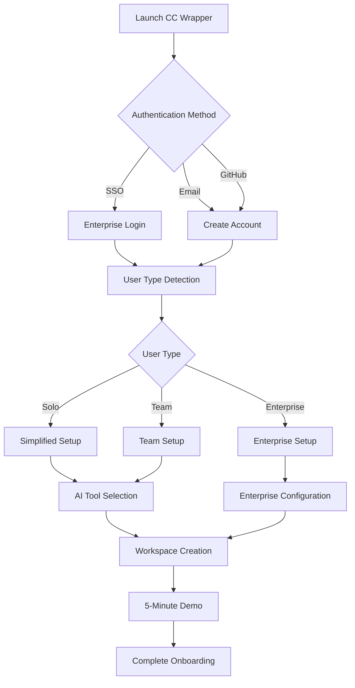
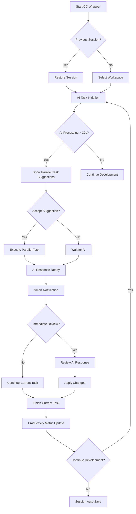
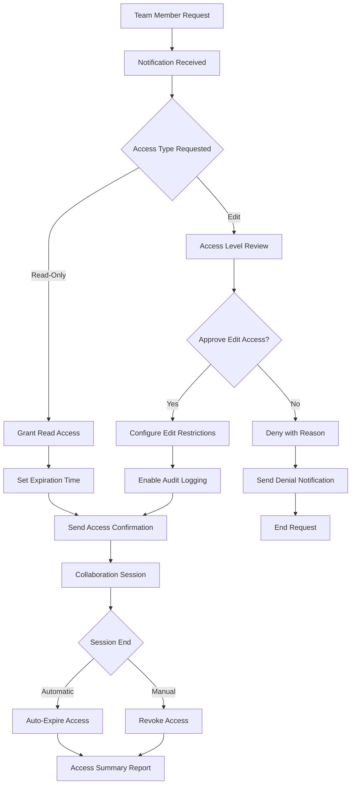
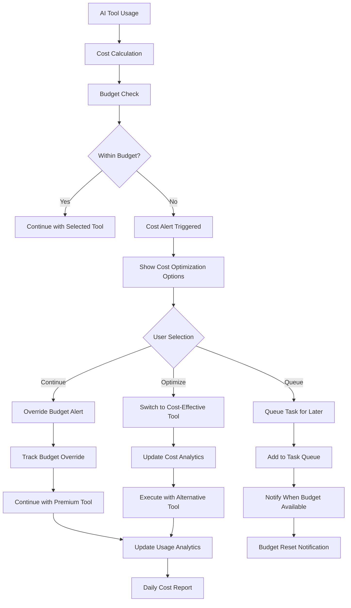
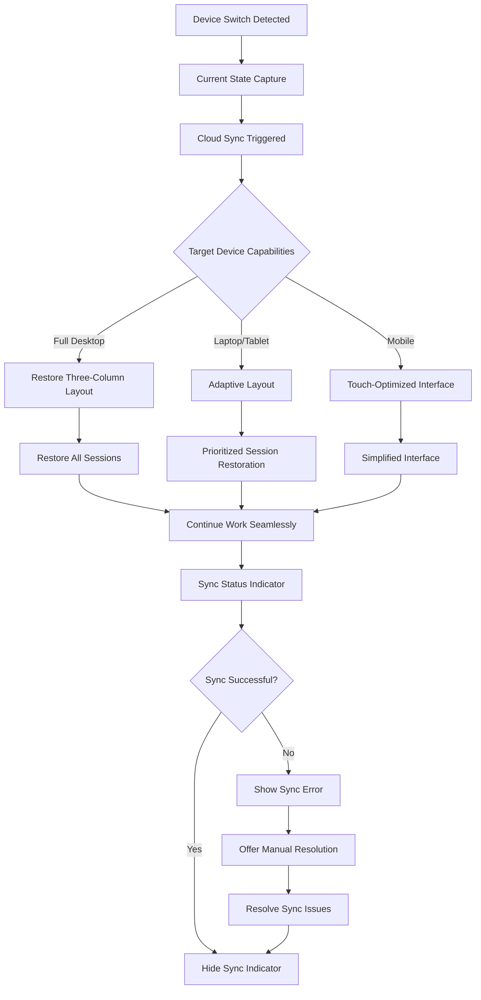

# CC Wrapper UX/UI Specification

_Generated on 2025-10-19 by Eduardo Menoncello_

## Executive Summary

CC Wrapper is a Level 3 enterprise SaaS platform that revolutionizes AI-assisted development productivity through intelligent wait-time optimization and multi-AI tool orchestration. The hybrid TUI/web interface features a revolutionary three-column layout (terminal, browser, AI context) that seamlessly integrates with developer workflows while delivering measurable productivity improvements within the first 5 minutes of use.

**Key Innovation:** Wait-time optimization that converts unproductive AI wait periods into valuable parallel task execution, addressing $2.1B annual productivity losses in the developer community.

**Target Market:** Enterprise developers, SMB teams, and independent developers using multiple AI tools, with projected $31.2M SOM in the AI orchestration platform market.

---

## 1. UX Goals and Principles

### 1.1 Target User Personas

**Primary Persona: Enterprise Alex**
- **Role:** Senior Developer at large enterprise
- **Goals:** Optimize team productivity, maintain security compliance, manage multiple projects
- **Pain Points:** Context switching between AI tools, security restrictions, budget management
- **Needs:** Role-based access control, audit trails, cost optimization, team collaboration

**Secondary Persona: SMB Sarah**
- **Role:** Solo developer at small business
- **Goals:** Rapid development, cost control, simple setup
- **Pain Points:** Limited AI tool budget, solo productivity, technical overhead
- **Needs:** Budget alerts, simplified interface, quick project setup

**Tertiary Persona: Independent Ian**
- **Role:** Independent developer/consultant
- **Goals:** Cross-platform compatibility, tool flexibility, performance optimization
- **Pain Points:** Tool fragmentation, device switching, performance constraints
- **Needs:** Multi-device sync, AI tool integration, performance monitoring

### 1.2 Usability Goals

**Primary Usability Objectives:**
- **5-Minute Wow:** 90% of new users experience measurable productivity benefits within first session
- **Zero Learning Curve:** Intuitive interface that matches existing terminal workflows
- **Sub-100ms Response:** Instant feedback for all terminal interactions and interface elements
- **60% Wait-Time Recovery:** Convert unproductive AI wait periods into productive parallel tasks
- **Enterprise-Grade Simplicity:** Simple interface for individuals, powerful features for enterprises

**Success Metrics:**
- 85% onboarding completion rate in first session
- 70% user retention after first week
- +40 Net Promoter Score for new users
- 90% reduction in context switching time

### 1.3 Design Principles

**1. Reliability-First Design**
- System continues functioning when individual components fail
- Automatic detection and recovery from common failure scenarios
- Redundant pathways for accomplishing critical tasks
- State validation and corruption prevention

**2. Terminal-Native Experience**
- Sub-100ms response times for all terminal interactions
- Keyboard-first accessibility for power users
- Predictable behavior consistent with terminal conventions
- Minimal distraction design that preserves developer flow

**3. Progressive Enhancement**
- Core functionality works under any conditions
- Advanced capabilities revealed gradually as users gain expertise
- Performance tiers adapt to available device capabilities
- Offline capabilities for critical functionality

**4. Context-Aware Assistance**
- Intelligent suggestions that match current workflow and context
- Non-intrusive notifications that respect user concentration
- Adaptive interface that adjusts based on user type and current task
- Smart defaults optimized for usage patterns

**5. Universal Accessibility**
- WCAG 2.1 AA compliance with full keyboard navigation
- High contrast support for users with visual impairments
- Large touch targets and voice control alternatives
- Clear information hierarchy and progressive disclosure

---

## 2. Information Architecture

### 2.1 Site Map

```
CC Wrapper Application
├── Authentication / Onboarding
│   ├── Login (SSO/Email/Password)
│   ├── User Type Detection (Solo/Team/Enterprise)
│   └── Progressive Onboarding Wizard
├── Dashboard / Workspace Hub
│   ├── Active Projects Overview
│   ├── Productivity Analytics
│   └── Quick Actions Panel
├── Workspace Management
│   ├── Project Selection / Creation
│   ├── Workspace Templates
│   └── Project Settings
├── Main Interface (Three-Column Layout)
│   ├── Terminal Panel (Left)
│   ├── Browser Panel (Center)
│   └── AI Context Panel (Right)
├── Settings & Configuration
│   ├── AI Tool Integration
│   ├── Notification Preferences
│   ├── Theme & Display
│   └── Security & Privacy
├── Analytics & Insights
│   ├── Productivity Dashboard
│   ├── Cost Management
│   └── Usage Analytics
└── Enterprise Features (Conditional)
    ├── Team Management
    ├── Audit Logs
    ├── Compliance Reports
    └── SSO Configuration
```

### 2.2 Navigation Structure

**Primary Navigation:**
- **Workspace Selector** (top-left) - Quick project switching with recent workspaces
- **Main Menu** (top-center) - Dashboard, Projects, Analytics, Settings
- **User Profile** (top-right) - Account settings, preferences, logout

**Secondary Navigation:**
- **Panel Controls** (column headers) - Minimize/maximize/resize panels
- **Context Tabs** (within panels) - Terminal sessions, browser tabs, AI conversations
- **Quick Actions** (floating) - New workspace, AI tool toggle, settings shortcut

**Mobile Navigation:**
- **Hamburger Menu** (top-left) - Collapsible navigation drawer
- **Tab Bar** (bottom) - Single-column navigation with gesture support
- **Floating Action Button** - Primary actions and AI interactions

**Keyboard Navigation:**
- **Ctrl+`** - Focus terminal panel
- **Ctrl+1/2/3** - Switch between columns
- **Ctrl+Tab** - Cycle through open tabs/sessions
- **Ctrl+/** - Show keyboard shortcuts help

---

## 3. User Flows

### 3.1 First-Time User Onboarding Flow



**Critical Steps:**
1. **User Type Detection** - Simple question determines interface complexity
2. **AI Tool Selection** - Max 2 tools initially, progressive disclosure for more
3. **5-Minute Demo** - Demonstrates wait-time optimization with immediate value
4. **Progressive Complexity** - Advanced features revealed as user gains expertise

**Success Criteria:**
- 90% completion rate within 10 minutes
- Immediate productivity value demonstrated
- User can accomplish meaningful task in first session

### 3.2 Daily Productivity Flow



**Key Interactions:**
- **Intelligent Wait Detection** - Monitors AI response times
- **Contextual Suggestions** - Task recommendations based on current project
- **Non-Intrusive Notifications** - Toast notifications for AI responses
- **Productivity Tracking** - Real-time time savings visualization

### 3.3 Team Collaboration Flow



**Enterprise Features:**
- **Role-Based Access** - Granular permissions with time-based controls
- **Audit Trail** - Immutable logging of all collaboration activities
- **Security Controls** - File restrictions, IP limitations, compliance checks

### 3.4 Cost Management Flow



**Cost Optimization Features:**
- **Real-Time Monitoring** - Continuous cost calculation and budget tracking
- **Smart Tool Selection** - Automatic switching based on cost vs. performance
- **Budget Controls** - Alerts, limits, and override capabilities
- **Usage Analytics** - Detailed cost breakdown and optimization recommendations

### 3.5 Cross-Device Continuity Flow



**Cross-Platform Features:**
- **Adaptive Interface** - Layout adjusts to device capabilities
- **State Preservation** - Complete workspace state maintained across devices
- **Performance Optimization** - Interface adapts to available resources
- **Offline Support** - Critical functionality available without connectivity

---

## 4. Component Library and Design System

### 4.1 Design System Approach

**Hybrid Approach:** Custom component library built on modern web standards with Material Design 3.0 principles for accessibility and consistency.

**Technology Stack:**
- **Base Framework:** Custom Web Components with TypeScript
- **Design Tokens:** CSS Custom Properties for theming and consistency
- **Animation Library:** Framer Motion for smooth interactions
- **Icon System:** Custom SVG icons with semantic meaning
- **Typography:** Inter font family for optimal readability

**Component Philosophy:**
- **Terminal Components:** Emulate terminal behavior with web capabilities
- **Progressive Enhancement:** Core functionality works, enhanced features added progressively
- **Performance First:** Lightweight components optimized for speed
- **Accessibility Built-In:** WCAG 2.1 AA compliance by default

### 4.2 Core Components

**Terminal Component (`cc-terminal`)**
- **Purpose:** Full terminal emulation with web integration capabilities
- **States:** Default, Focus, Error, Offline, Loading
- **Variants:** Standard, Compact, Full-screen
- **Features:** Command history, syntax highlighting, web link detection
- **Accessibility:** Full keyboard navigation, screen reader support, high contrast mode

**Browser Panel (`cc-browser`)**
- **Purpose:** Integrated web browser for documentation and AI interactions
- **States:** Loading, Loaded, Error, Offline
- **Variants:** Standard, Reader mode, Dev tools
- **Features:** Tab management, bookmark integration, AI chat overlay
- **Accessibility:** Zoom controls, reading mode, keyboard navigation

**AI Context Panel (`cc-ai-context`)**
- **Purpose:** AI conversation history and contextual suggestions
- **States:** Active, Processing, Error, Offline
- **Variants:** Expanded, Collapsed, Minimal
- **Features:** Conversation threading, suggestion cards, cost indicators
- **Accessibility:** Voice input support, screen reader optimization

**Notification System (`cc-notification`)**
- **Purpose:** Non-intrusive alerts and AI response notifications
- **States:** Info, Success, Warning, Error
- **Variants:** Toast, Banner, Inline, Modal
- **Features:** Batching, snoozing, smart positioning, quiet hours
- **Accessibility:** ARIA live regions, keyboard dismissal, high contrast

**Workspace Manager (`cc-workspace`)**
- **Purpose:** Project workspace creation and management
- **States:** Setup, Active, Archived, Error
- **Variants:** Grid view, List view, Card view
- **Features:** Templates, quick access, collaboration indicators
- **Accessibility:** Semantic landmarks, keyboard navigation, screen reader support

**Productivity Dashboard (`cc-analytics`)**
- **Purpose:** Visualize productivity metrics and cost analytics
- **States:** Loading, Data available, No data, Error
- **Variants:** Summary, Detailed, Comparison
- **Features:** Time savings charts, cost breakdowns, trend analysis
- **Accessibility:** Data tables as fallback, color-blind friendly palettes, keyboard navigation

**AI Tool Integration (`cc-ai-tool`)**
- **Purpose:** Connect and manage multiple AI service integrations
- **States:** Connected, Disconnected, Error, Rate-limited
- **Variants:** Card, List, Compact
- **Features:** Status indicators, usage metrics, cost tracking
- **Accessibility:** Clear status indicators, keyboard controls, error messaging

**Cost Management (`cc-cost-manager`)**
- **Purpose:** Monitor and control AI tool spending
- **States:** Within budget, Warning, Over budget, Error
- **Variants:** Summary, Detailed, Alerts only
- **Features:** Budget controls, spending alerts, optimization suggestions
- **Accessibility:** Clear financial indicators, keyboard controls, alert alternatives

**Settings Panel (`cc-settings`)**
- **Purpose:** Application configuration and preferences
- **States:** Default, Modified, Error, Saving
- **Variants:** Tabbed, Categorized, Search
- **Features:** Real-time preview, validation, import/export
- **Accessibility:** Form labels, error descriptions, keyboard navigation

---

## 5. Visual Design Foundation

### 5.1 Color Palette

**Primary Colors (Dark Theme)**
- **Background Primary:** #0D1117 (GitHub Dark)
- **Background Secondary:** #161B22
- **Background Tertiary:** #21262D
- **Border Default:** #30363D
- **Border Muted:** #21262D

**Accent Colors**
- **Primary Blue:** #0969DA (Primary actions, links)
- **Success Green:** #1A7F37 (Success states, positive indicators)
- **Warning Orange:** #D19A66 (Warnings, cost alerts)
- **Error Red:** #DA3633 (Error states, critical alerts)
- **Info Purple:** #8B5CF6 (Information, AI suggestions)

**Text Colors**
- **Text Primary:** #F0F6FC (High contrast text)
- **Text Secondary:** #8B949E (Secondary text, descriptions)
- **Text Tertiary:** #6E7681 (Muted text, placeholders)
- **Text Link:** #58A6FF (Links, interactive elements)

**Terminal Colors**
- **Terminal Background:** #000000
- **Terminal Text:** #FFFFFF
- **Terminal Green:** #00FF00 (Success output)
- **Terminal Yellow:** #FFFF00 (Warnings)
- **Terminal Red:** #FF0000 (Errors)
- **Terminal Blue:** #0000FF (Information)

**Semantic Color Meanings**
- **Blue:** Primary actions, navigation, active states
- **Green:** Success, completed tasks, positive metrics
- **Orange/Amber:** Warnings, budget alerts, attention needed
- **Red:** Errors, critical issues, destructive actions
- **Purple:** AI interactions, suggestions, intelligent features
- **Gray:** Neutral elements, disabled states, borders

### 5.2 Typography

**Font Families:**
```css
--font-primary: 'Inter', system-ui, -apple-system, sans-serif;
--font-mono: 'JetBrains Mono', 'Fira Code', 'Consolas', monospace;
--font-terminal: 'Cascadia Code', 'JetBrains Mono', monospace;
```

**Type Scale:**
- **Display Large:** 32px / 48px (Hero titles, major headings)
- **Display Medium:** 24px / 32px (Page titles, section headers)
- **Headline Large:** 20px / 28px (Card titles, major headings)
- **Headline Medium:** 18px / 24px (Section headings, card headers)
- **Title Large:** 16px / 24px (Component titles, labels)
- **Title Medium:** 14px / 20px (Subtitles, secondary labels)
- **Body Large:** 16px / 24px (Primary body text)
- **Body Medium:** 14px / 20px (Secondary body text)
- **Body Small:** 12px / 16px (Metadata, captions)
- **Label Large:** 14px / 20px (Form labels, button text)
- **Label Medium:** 12px / 16px (Small labels, tags)

**Terminal Typography:**
- **Terminal Text:** 14px / 20px (Readable terminal font size)
- **Terminal Title:** 12px / 16px (Tab labels, status indicators)
- **Terminal Input:** 14px / 20px (User input area)

**Font Weights:**
- **Light (300):** Large display text, decorative elements
- **Regular (400):** Body text, standard content
- **Medium (500):** Emphasis, subheadings
- **Semibold (600):** Headings, important labels
- **Bold (700):** Strong emphasis, titles

### 5.3 Spacing and Layout

**Spacing Scale (8px base):**
- **Space 0:** 0px (No spacing)
- **Space 1:** 4px (Micro spacing)
- **Space 2:** 8px (Base spacing unit)
- **Space 3:** 12px (Small spacing)
- **Space 4:** 16px (Medium spacing)
- **Space 6:** 24px (Large spacing)
- **Space 8:** 32px (Extra large spacing)
- **Space 12:** 48px (Section spacing)
- **Space 16:** 64px (Page spacing)
- **Space 24:** 96px (Major sections)

**Layout Grid:**
- **Container Max Width:** 1920px (4K displays)
- **Standard Container:** 1200px (desktop)
- **Narrow Container:** 800px (focused content)
- **Gutter Width:** 24px (standard gutters)
- **Column Count:** 12-column responsive grid

**Three-Column Layout:**
- **Terminal Panel:** 30% width (minimum 400px)
- **Browser Panel:** 40% width (minimum 600px)
- **AI Context Panel:** 30% width (minimum 300px)
- **Panel Gutter:** 8px (minimum spacing)
- **Resizable Panels:** Drag to resize with minimum constraints

**Component Spacing:**
- **Component Padding:** 16px (standard padding)
- **Component Margin:** 8px (component spacing)
- **Card Padding:** 24px (content cards)
- **Button Padding:** 12px 24px (standard buttons)
- **Input Padding:** 12px 16px (form inputs)

**Border Radius:**
- **Radius Small:** 4px (buttons, inputs, small elements)
- **Radius Medium:** 8px (cards, panels)
- **Radius Large:** 12px (modals, large containers)
- **Radius Full:** 50% (circular elements, avatars)

**Shadows:**
- **Shadow Small:** 0 1px 3px rgba(0,0,0,0.12) (subtle elevation)
- **Shadow Medium:** 0 4px 12px rgba(0,0,0,0.15) (cards, panels)
- **Shadow Large:** 0 8px 24px rgba(0,0,0,0.18) (modals, overlays)
- **Shadow Terminal:** 0 2px 8px rgba(0,0,0,0.8) (terminal panel)

---

## 6. Responsive Design

### 6.1 Breakpoints

**Device-Based Breakpoints:**
- **Mobile:** 320px - 767px (Smartphones, small tablets)
- **Tablet:** 768px - 1023px (Tablets, large phones)
- **Laptop:** 1024px - 1439px (Small laptops, large tablets)
- **Desktop:** 1440px - 1919px (Standard desktop)
- **Large Desktop:** 1920px+ (Large displays, 4K monitors)

**Container-Based Breakpoints:**
- **Compact:** < 600px (Mobile layout)
- **Standard:** 600px - 1024px (Tablet layout)
- **Expanded:** 1024px - 1440px (Laptop layout)
- **Wide:** > 1440px (Desktop layout)

**Performance-Based Breakpoints:**
- **Low Performance:** < 4GB RAM, < 2 CPU cores
- **Medium Performance:** 4-8GB RAM, 2-4 CPU cores
- **High Performance:** > 8GB RAM, > 4 CPU cores

### 6.2 Adaptation Patterns

**Mobile Layout (< 768px):**
- **Single Column:** Vertical stacking of all panels
- **Bottom Navigation:** Tab bar for switching between terminal, browser, AI
- **Floating Action Button:** Quick access to primary actions
- **Touch-Optimized:** Larger touch targets (44px minimum)
- **Gesture Support:** Swipe gestures for panel switching
- **Simplified Interface:** Progressive disclosure of advanced features

**Tablet Layout (768px - 1023px):**
- **Two Column:** Terminal + Browser/Browser + AI (user selectable)
- **Side Navigation:** Collapsible drawer for secondary navigation
- **Adaptive Panels:** Automatic panel prioritization based on context
- **Touch + Keyboard:** Support for both input methods
- **Split-Screen Mode:** Support for tablet split-screen multitasking

**Laptop Layout (1024px - 1439px):**
- **Three Column Compressed:** Full three-column with reduced spacing
- **Collapsible Panels:** Ability to minimize non-essential panels
- **Keyboard Optimization:** Enhanced keyboard shortcuts and navigation
- **Window Management:** Support for window snapping and resizing

**Desktop Layout (> 1440px):**
- **Full Three Column:** Optimal three-column layout with maximum space
- **Advanced Features:** All features and panels visible
- **Multi-Monitor Support:** Panel distribution across multiple monitors
- **Performance Optimization:** Full feature set with enhanced animations

**Performance Adaptation:**
- **Low Performance Mode:** Disabled animations, reduced visual effects, simplified layouts
- **Background Processing:** Intelligent task scheduling during idle time
- **Resource Monitoring:** Real-time performance tracking and optimization
- **Progressive Loading:** Content loaded based on priority and available resources

**Accessibility Adaptation:**
- **High Contrast Mode:** Enhanced contrast ratios for visibility
- **Large Text Mode:** Scalable text up to 200% without layout break
- **Reduced Motion:** Option to disable animations and transitions
- **Screen Reader Optimization:** Semantic HTML and ARIA labels

---

## 7. Accessibility

### 7.1 Compliance Target

**WCAG 2.1 AA Compliance** - Full adherence to Web Content Accessibility Guidelines

**Key Compliance Areas:**
- **Perceivable:** Information must be presentable in ways users can perceive
- **Operable:** Interface components must be operable and keyboard accessible
- **Understandable:** Information and operation must be understandable
- **Robust:** Content must be robust enough for various assistive technologies

**Target User Groups:**
- **Visual Impairments:** Screen reader users, low vision users, color blind users
- **Motor Impairments:** Keyboard-only users, voice control users
- **Cognitive Disabilities:** Users with attention disorders, learning disabilities
- **Temporary Disabilities:** Users with temporary injuries or situational limitations

### 7.2 Key Requirements

**Visual Accessibility:**
- **Color Contrast:** Minimum 4.5:1 contrast ratio for normal text, 3:1 for large text
- **Focus Indicators:** Visible focus indicators on all interactive elements (2px minimum)
- **Text Scaling:** Support for 200% zoom without horizontal scrolling
- **Color Independence:** Information not conveyed through color alone
- **High Contrast Mode:** Alternative high contrast theme available

**Keyboard Accessibility:**
- **Full Keyboard Navigation:** All functionality accessible via keyboard
- **Tab Order:** Logical tab order following visual layout
- **Keyboard Shortcuts:** Comprehensive keyboard shortcuts for power users
- **Skip Links:** Skip navigation links for keyboard users
- **Focus Management:** Proper focus management in dynamic interfaces

**Screen Reader Support:**
- **Semantic HTML:** Proper use of headings, landmarks, and semantic elements
- **ARIA Labels:** Descriptive ARIA labels for custom components
- **Live Regions:** ARIA live regions for dynamic content updates
- **Error Announcements:** Screen reader announcements for errors and validation
- **Status Announcements:** Status updates and progress indicators

**Motor Accessibility:**
- **Large Touch Targets:** Minimum 44px touch targets for mobile devices
- **Click Targets:** Minimum 24px click targets for mouse interactions
- **Voice Control:** Voice command support for major functions
- **Gesture Alternatives:** Keyboard and voice alternatives to touch gestures
- **Timing Controls:** Ability to extend or disable time limits

**Cognitive Accessibility:**
- **Clear Language:** Simple, direct language for all interface elements
- **Consistent Layout:** Predictable placement of controls and information
- **Error Prevention:** Confirmation dialogs for destructive actions
- **Help Integration:** Context-sensitive help available throughout interface
- **Progressive Disclosure:** Complex information revealed gradually

**Technical Implementation:**
- **Semantic HTML5:** Proper use of header, nav, main, section, article elements
- **ARIA Implementation:** Comprehensive ARIA support for custom components
- **Testing Protocol:** Regular accessibility testing with screen readers
- **Automated Testing:** Integration with accessibility testing tools
- **User Testing:** Accessibility testing with users with disabilities

---

## 8. Interaction and Motion

### 8.1 Motion Principles

**Purposeful Animation:** All animations serve a functional purpose, not decorative

**Performance First:** Animations run at 60fps on target devices, with graceful degradation

**Accessibility Aware:** Motion can be reduced or disabled based on user preferences

**Contextual Timing:** Animation duration matches user expectations and task importance

**Consistent Easing:** Natural easing functions that feel responsive and intuitive

**Motion Guidelines:**
- **Micro Interactions:** 150-200ms (button clicks, hover states)
- **State Changes:** 200-300ms (panel switches, tab changes)
- **Layout Updates:** 300-500ms (panel resizing, content loading)
- **Page Transitions:** 400-600ms (major view changes)
- **Loading States:** 800-1200ms (content loading, data fetching)

### 8.2 Key Animations

**Terminal Typing Animation:**
- **Duration:** 0ms (instant character appearance for performance)
- **Purpose:** Maintain terminal responsiveness
- **Implementation:** CSS text-shadow for cursor blink

**Panel Switching:**
- **Duration:** 250ms with ease-in-out timing
- **Purpose:** Smooth transitions between panels
- **Implementation:** CSS transform and opacity transitions
- **Accessibility:** Respects prefers-reduced-motion

**AI Response Notification:**
- **Duration:** 300ms slide-in, 5000ms auto-dismiss
- **Purpose:** Non-intrusive alert for AI responses
- **Implementation:** CSS transform from right with bounce effect
- **User Control:** Manual dismiss, snooze, disable options

**Workspace Loading:**
- **Duration:** 800ms staggered animation
- **Purpose:** Visual feedback during workspace restoration
- **Implementation:** Progressive loading with skeleton screens
- **Performance GPU acceleration:** CSS transform3d for smooth animation

**Error Recovery:**
- **Duration:** 400ms shake animation for critical errors
- **Purpose:** Draw attention to error states
- **Implementation:** CSS keyframe animation with reduced motion support
- **Accessibility:** Visual indication with accompanying screen reader announcement

**Cost Alert Animation:**
- **Duration:** 600ms pulse animation
- **Purpose:** Draw attention to budget warnings
- **Implementation:** CSS animation with color transitions
- **Frequency:** Limited to prevent alert fatigue

**Sync Status Animation:**
- **Duration:** 2000ms rotating animation
- **Purpose:** Indicate ongoing synchronization
- **Implementation:** CSS animation with linear timing
- **States:** Active, success, error with different colors

**Progressive Enhancement:**
- **No Motion:** Instant state changes for reduced motion preference
- **Standard Motion:** Default animations for enhanced experience
- **Enhanced Motion:** Additional animations for high-performance devices
- **Performance Monitoring:** Automatic quality adjustment based on device capabilities

---

## 9. Design Files and Wireframes

### 9.1 Design Files

**Design Tool Strategy:**
- **Primary Tool:** Figma for comprehensive design system and wireframes
- **Component Library:** Standalone Figma library for design tokens
- **Prototyping:** Figma interactive prototypes for user testing
- **Version Control:** Git integration for design file management
- **Developer Handoff:** Figma Dev Mode for implementation specifications

**Design File Structure:**
```
CC Wrapper Design System/
├── Design Tokens/
│   ├── Colors.figma
│   ├── Typography.figma
│   ├── Spacing.figma
│   └── Shadows Effects.figma
├── Component Library/
│   ├── Core Components.figma
│   ├── Terminal Components.figma
│   ├── AI Components.figma
│   └── Layout Components.figma
├── Screen Designs/
│   ├── Onboarding Flow.figma
│   ├── Main Interface.figma
│   ├── Settings Panels.figma
│   └── Mobile Layouts.figma
├── Prototypes/
│   ├── User Flow Testing.figma
│   ├── Interaction Patterns.figma
│   └── Responsive Behavior.figma
└── Documentation/
    ├── Component Guidelines.md
    ├── Usage Examples.md
    └── Developer Handoff.md
```

### 9.2 Key Screen Layouts

**Screen Layout 1: Onboarding - User Type Detection**
```
┌─────────────────────────────────────────────────────────────┐
│ CC Wrapper                                    [Skip] [Help] │
├─────────────────────────────────────────────────────────────┤
│                                                             │
│        Welcome to CC Wrapper!                              │
│                                                             │
│    How do you primarily use AI tools?                      │
│                                                             │
│    ┌─────────────────┐  ┌─────────────────┐  ┌─────────────┐│
│    │   Solo Development│  │  Small Team    │  │ Enterprise  ││
│    │                 │  │  Collaboration  │  │ Environment ││
│    │                 │  │                 │  │             ││
│    │   Individual    │  │    Team-Based   │  │ Organization││
│    │   Productivity  │  │    Productivity │  │   Productivity││
│    │                 │  │                 │  │             ││
│    └─────────────────┘  └─────────────────┘  └─────────────┘│
│                                                             │
│               [Continue] →                                  │
│                                                             │
└─────────────────────────────────────────────────────────────┘
```

**Key Features:**
- Clear visual hierarchy with card-based layout
- Icons representing each user type
- Progressive disclosure of complexity based on selection
- Accessibility support with semantic HTML and ARIA labels

**Screen Layout 2: Main Interface - Three Column Layout**
```
┌─────────────────────────────────────────────────────────────┐
│ CC Wrapper │ [Project Alpha] │ [Dashboard] [Analytics] [Settings] │ [👤 Alex] │
├─────────┬───────────────────┬─────────────────────────────────────┤
│ Terminal│    Browser Panel   │          AI Context Panel            │
│ Panel   │                    │                                     │
│         │ ┌─────────────────┐│ ┌─────────────────────────────────┐ │
│ $ npm   │ │ Documentation   ││ │   Active AI Conversations       │ │
│ install │ │                 ││ │                                 │ │
│         │ │ React component  ││ │ Claude: Code refactoring...     │ │
│ [output]│ │ examples         ││ │ ─────────────────────────────   │ │
│         │ │                 ││ │ Processing... ⏱ 2:15           │ │
│ $ git   │ │ API reference    ││ │                                 │ │
│ commit  │ │                 ││ │ 💡 Parallel Task Suggestion:     │ │
│ -m "feat│ │                 ││ │ Review recent code changes      │ │
│ add     │ │ Live preview     ││ │ [Accept] [Dismiss]              │ │
│ component│ │                 ││ │                                 │ │
│         │ └─────────────────┘│ │ ChatGPT: Database design...     │ │
│ [input] │                    │ │ ─────────────────────────────   │ │
└─────────┴───────────────────┘ │ Ready! ✓                       │ │
                              │ │                                 │ │
                              │ │ GitHub Copilot: Test cases...   │ │
                              │ └─────────────────────────────────┘ │
└─────────────────────────────────────────────────────────────┘
```

**Key Features:**
- Resizable three-column layout with minimum width constraints
- Real-time AI response processing with wait-time detection
- Parallel task suggestions based on current context
- Multi-AI tool integration with unified interface
- Terminal-native experience with web capabilities

**Screen Layout 3: Mobile Interface - Adaptive Layout**
```
┌─────────────────────────────┐
│ ☰ CC Wrapper       [🔧] [👤] │
├─────────────────────────────┤
│                             │
│   📊 Project Alpha          │
│   Last sync: 2 min ago      │
│                             │
│ ┌─────────────────────────┐ │
│ │      Terminal            │ │
│ │                         │ │
│ │ $ npm test              │ │
│ │ ✓ Tests passed          │ │
│ │                         │ │
│ └─────────────────────────┘ │
│                             │
│ 🤖 AI Response Ready!       │
│ ┌─────────────────────────┐ │
│ │ Claude: Component       │ │
│ │ optimization complete   │ │
│ │ [View] [Dismiss]        │ │
│ └─────────────────────────┘ │
│                             │
│ ┌─────────────────────────┐ │
│ │    💡 Suggestion        │ │
│ │                        │ │
│ │ Run integration tests   │ │
│ │ while AI processes      │ │
│ │ [Start] [Later]        │ │
│ └─────────────────────────┘ │
├─────────────────────────────┤
│ [Terminal] [Browser] [AI]   │
└─────────────────────────────┘
```

**Key Features:**
- Single-column layout optimized for mobile devices
- Bottom navigation for quick panel switching
- Touch-optimized interface with large touch targets
- Progressive disclosure of features based on screen size
- Swipe gestures for enhanced mobile interaction

**Screen Layout 4: Analytics Dashboard**
```
┌─────────────────────────────────────────────────────────────┐
│ CC Wrapper │ Analytics │ Time Range: [Last 7 Days ▼] │ [Export] │
├─────────────────────────────────────────────────────────────┤
│                                                             │
│  📈 Productivity Summary                                    │
│ ┌─────────────────┬─────────────────┬─────────────────────┐ │
│ │ Time Saved      │ AI Wait Time    │ Tasks Completed    │ │
│ │                 │ Optimized       │                     │ │
│ │   12h 35m       │    8h 20m       │        47          │ │
│ │   +23% vs last  │   +67% vs last  │    +15% vs last    │ │
│ │     week        │     week        │       week         │ │
│ └─────────────────┴─────────────────┴─────────────────────┘ │
│                                                             │
│  💰 Cost Management                                         │
│ ┌─────────────────────────────────────────────────────────┐ │
│ │ Budget Used: $127.50 of $150.00 (85%)                   │ │
│ │ ████████████████████░░░░░                                │ │
│ │                                                         │ │
│ │ Tool Breakdown:                                         │ │
│ │ Claude: $45.20  | ChatGPT: $38.10 | Copilot: $44.20   │ │
│ └─────────────────────────────────────────────────────────┘ │
│                                                             │
│  🎯 AI Tool Usage Patterns                                 │
│ ┌─────────────────┬─────────────────┬─────────────────────┐ │
│ │ Most Used Tool  │ Avg Response    │ Success Rate       │ │
│ │                 │ Time            │                     │ │
│ │ Claude          │ 1m 45s          │       94%          │ │
│ │ ChatGPT         │ 2m 12s          │       89%          │ │
│ │ Copilot         │ 0m 30s          │       97%          │ │
│ └─────────────────┴─────────────────┴─────────────────────┘ │
│                                                             │
│  🚀 Optimization Suggestions                               │
│ • Switch to ChatGPT for documentation tasks (save $12/day) │
│ • Enable batch processing for similar requests              │
│ • Consider local AI model for simple queries                │
└─────────────────────────────────────────────────────────────┘
```

**Key Features:**
- Comprehensive productivity metrics with trend analysis
- Real-time cost tracking with budget alerts
- AI tool performance comparison and optimization suggestions
- Data visualization with accessibility support
- Export capabilities for reporting and sharing

---

## 10. Next Steps

### 10.1 Immediate Actions

**Development Priorities (Next 2-4 weeks):**

1. **Component Library Foundation**
   - Set up design system with tokens and base components
   - Implement core components: Terminal, Browser, AI Context panels
   - Create responsive layout system for three-column interface
   - Establish accessibility testing framework

2. **User Onboarding Flow**
   - Implement progressive onboarding based on user type
   - Create 5-minute wow experience demonstrating wait-time optimization
   - Build AI tool integration setup wizard
   - Develop session persistence and recovery

3. **Core Interface Development**
   - Implement three-column layout with resizable panels
   - Build real-time synchronization engine
   - Create notification system for AI responses
   - Develop parallel task suggestion system

4. **Performance Optimization**
   - Implement adaptive performance based on device capabilities
   - Create offline functionality with sync recovery
   - Optimize for sub-100ms response times
   - Establish performance monitoring and reporting

**Design Handoff Preparation:**
- Finalize design tokens and component specifications
- Create comprehensive component documentation
- Prepare responsive design specifications
- Establish accessibility testing protocols
- Set up design-to-development workflow

### 10.2 Design Handoff Checklist

**Component Library Complete:**
- [ ] All core components designed with multiple states
- [ ] Design tokens established for colors, typography, spacing
- [ ] Component variants defined (primary, secondary, tertiary)
- [ ] Accessibility specifications included for all components
- [ ] Animation specifications documented
- [ ] Responsive behavior defined for each component

**User Interface Documentation:**
- [ ] Complete user flow documentation with decision points
- [ ] Wireframes for all major screens and states
- [ ] Responsive design specifications for all breakpoints
- [ ] Error state and edge case designs
- [ ] Loading state and skeleton screen designs
- [ ] Animation and transition specifications

**Accessibility Documentation:**
- [ ] WCAG 2.1 AA compliance checklist completed
- [ ] Screen reader testing protocol established
- [ ] Keyboard navigation specification
- [ ] Color contrast analysis completed
- [ ] High contrast mode specifications
- [ ] Reduced motion alternatives designed

**Technical Specifications:**
- [ ] Component prop interfaces defined
- [ ] State management patterns documented
- [ ] Performance optimization guidelines
- [ ] Browser compatibility matrix
- [ ] Device capability detection strategy
- [ ] Progressive enhancement approach documented

**Testing Strategy:**
- [ ] Component testing library setup
- [ ] Accessibility testing tools integrated
- [ ] Performance testing benchmarks established
- [ ] Cross-browser testing protocol
- [ ] User testing scenarios defined
- [ ] A/B testing framework prepared

**Developer Resources:**
- [ ] Component library documentation site
- [ ] Usage examples and code samples
- [ ] Design system guidelines
- [ ] Implementation best practices
- [ ] Troubleshooting guide
- [ ] Support contact information

---

## Appendix

### Related Documents

- **PRD:** `./PRD.md` - Comprehensive product requirements document
- **Epics:** `./epics.md` - Detailed epic breakdown with story specifications
- **Architecture:** `./solution-architecture.md` - Technical architecture design
- **Research:** `./research-*.md` - Market, technical, and user research findings

### Version History

| Date     | Version | Changes                      | Author        |
| -------- | ------- | ---------------------------- | ------------- |
| 2025-10-19 | 1.0     | Initial UX specification     | Eduardo Menoncello |

### Implementation Notes

**Technology Stack Recommendations:**
- **Frontend Framework:** React 18 with TypeScript for component development
- **State Management:** Zustand or Redux Toolkit for application state
- **Styling:** Tailwind CSS with custom design system tokens
- **Terminal Emulation:** xterm.js for web-based terminal functionality
- **Animation:** Framer Motion for smooth interactions
- **Testing:** React Testing Library + Playwright for E2E testing
- **Accessibility:** axe-core for automated accessibility testing

**Performance Considerations:**
- Implement code splitting for optimal loading performance
- Use Web Workers for intensive computations
- Optimize bundle size with tree shaking and compression
- Implement service worker for offline capabilities
- Monitor Core Web Vitals for performance optimization

**Security Considerations:**
- Implement content security policy for XSS protection
- Use secure storage for API keys and sensitive data
- Implement proper authentication and authorization flows
- Regular security audits and penetration testing
- Compliance with data protection regulations (GDPR, CCPA)

---

*This UX specification serves as the comprehensive guide for designing and implementing the CC Wrapper user interface, ensuring a consistent, accessible, and delightful user experience across all platforms and devices.*